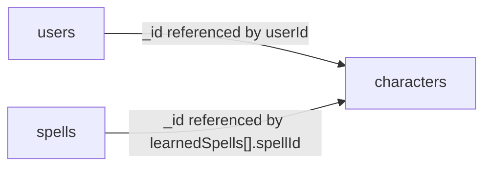

# Database Schema

MongoDB Atlas schema for the D&D mobile app.

## Overview

The app stores user accounts, the characters they own, and a shared catalog of spells in a single MongoDB Atlas database. Three collections are used:

| Collection   | Purpose                                                  |
| ------------ | -------------------------------------------------------- |
| `users`      | User accounts. Default-user today, OAuth-only later.     |
| `characters` | One document per character, owned by a user.             |
| `spells`     | Shared spell catalog referenced by characters.           |

### Authentication state

- **Now (early development):** the database holds a single seeded "default" user. The mobile app has no login screen and every read/write uses this user's `_id`.
- **Later:** OAuth becomes the only way to sign up and log in. Each successful OAuth sign-up creates a new `users` document. The schema does not need to change for that transition.

## Conventions

- Every document has an `_id` of type `ObjectId` unless otherwise noted.
- Every top-level document has `createdAt` and `updatedAt` timestamps (`Date`).
- Embedded subdocuments inside arrays that the UI may edit individually (e.g. inventory items) carry their own `_id` so they can be addressed via `$set` / `$pull` / `arrayFilters`.
- Computed game values (saving-throw totals, skill modifiers, etc.) are **not** stored. They are derived in app code from ability scores, level, and proficiency lists. Only the inputs are persisted.

## Entity relationships



- A `user` has many `characters` (one-to-many via `characters.userId`).
- A `character` references many `spells` (many-to-many via embedded `learnedSpells[].spellId`).

## `users`

```js
{
  _id: ObjectId,
  authProvider: "default" | "google" | "apple" | "github",
  authProviderId: string | null,   // provider's user id; null for the default user
  email: string | null,
  displayName: string,
  avatarUrl: string | null,
  createdAt: Date,
  updatedAt: Date
}
```

### Field notes

- `authProvider` — identifies how the account was created. The literal value `"default"` is reserved for the seeded development user. Once OAuth is live, only the listed provider values are accepted.
- `authProviderId` — the user's unique id at the OAuth provider (Google `sub`, Apple `sub`, GitHub numeric id, etc.). `null` only for the default user.
- `email` / `avatarUrl` — taken from the provider when available. May be `null` if the provider doesn't supply them.
- `displayName` — required for every user; UI fallback when no avatar is available.

### Indexes

```js
db.users.createIndex(
  { authProvider: 1, authProviderId: 1 },
  { unique: true, partialFilterExpression: { authProviderId: { $type: "string" } } }
);
```

The partial filter keeps the default user (which has `authProviderId: null`) from blocking future OAuth inserts that share `null`.

### Default-user seed

A single document is inserted by hand or with a one-off script:

```js
{
  _id: ObjectId("000000000000000000000001"), // fixed, well-known id
  authProvider: "default",
  authProviderId: null,
  email: null,
  displayName: "Default Adventurer",
  avatarUrl: null,
  createdAt: <now>,
  updatedAt: <now>
}
```

The mobile app keeps this `_id` in a config constant and uses it for every query until OAuth is wired up.

### OAuth migration path

When OAuth ships:

1. Build the OAuth flow; on first successful sign-in, insert a new `users` document with the provider data.
2. Either keep the seeded default user as a dev-only account or delete it.
3. Reject new writes where `authProvider === "default"`.

No schema changes are required.

## `characters`

One document per character. Owned by exactly one user (`userId`). Embeds the main sheet, characteristics, learned-spell references, spell slots, and inventory.

```js
{
  _id: ObjectId,
  userId: ObjectId,                 // -> users._id
  name: string,
  photoUri: string | null,

  mainSheet: {
    abilities: {
      STR: number, DEX: number, CON: number,
      INT: number, WIS: number, CHA: number
    },
    proficientSaves: [
      "STR" | "DEX" | "CON" | "INT" | "WIS" | "CHA"
    ],
    proficientSkills: [
      "Acrobatics" | "Animal Handling" | "Arcana" | "Athletics" |
      "Deception"  | "History" | "Insight" | "Intimidation" |
      "Investigation" | "Medicine" | "Nature" | "Perception" |
      "Performance" | "Persuasion" | "Religion" |
      "Sleight of Hand" | "Stealth" | "Survival"
    ],
    hp:               { current: number, max: number },
    proficiencyBonus: number,
    armorClass:       number,
    inspiration:      number,
    initiative:       number,
    speed:            number
  },

  characteristics: {
    class:    "Paladin" | "Fighter" | "Cleric" | "Wizard" | "Rogue",
    level:             number,
    experience:        number,
    race:    "Elf" | "Dwarf" | "Human" | "Dragonborn",
    alignment:         string,
    gender:            string,
    eyes:              string,
    size:              string,
    height:            string,
    age:               number,
    faith:             string,
    skin:              string,
    background:        string,
    personalityTraits: string,
    bonds:             string,
    ideals:            string,
    flaws:             string
  },

  learnedSpells: [
    {
      spellId:        ObjectId,    // -> spells._id
      prepared:       boolean,
      alwaysPrepared: boolean
    }
  ],

  spellSlots: [
    {
      level:   number,             // 1..9 (cantrips don't use slots)
      current: number,             // unspent slots remaining
      max:     number              // total slots at this level
    }
  ],

  inventory: {
    currency: {
      gold:   number,
      silver: number,
      copper: number
    },
    items: [
      {
        _id:                ObjectId,
        name:               string,
        description:        string,
        requiresAttunement: boolean,   // does the item require attunement at all?
        attuned:            boolean    // is the character currently attuned to it?
      }
    ]
  },

  createdAt: Date,
  updatedAt: Date
}
```

### Field notes

- `userId` — owner. Every list/read query in the app filters by it.
- `name`, `photoUri` — header data shown on the character sheet (matches `CharacterInfo.name` / `photoUri` in `types/character.ts`).

#### `mainSheet`

- `abilities` — raw ability scores 1–30. The ability **modifier** shown in the UI is computed in the app via `Math.floor((score - 10) / 2)` and is not stored.
- `proficientSaves` — list of ability keys for which the character is proficient on saving throws. Saving-throw totals are computed from this list using the same logic as `services/CharacterService.ts` (`mod + (proficient ? proficiencyBonus : 0)`).
- `proficientSkills` — list of skill keys (must match the keys defined in `types/skills.ts`). Skill totals are computed from this list using the same logic as `services/SkillService.ts`.
- `hp.current` / `hp.max` — current and maximum hit points.
- `proficiencyBonus` — by-the-book this can be derived from `level` (`Math.floor((level - 1) / 4) + 2`). It is stored to allow homebrew or feature-driven overrides.
- `armorClass` — final AC after armor, shield, and modifiers.
- `inspiration` — kept as a number (rather than boolean) so future homebrew can support multiple charges. Today, expect `0` or `1`.
- `initiative` — usually equal to the DEX modifier; stored to allow magic items, feats, and class features (e.g. Alert) to override.
- `speed` — movement speed in feet per round.

#### `characteristics`

All flavor and progression fields. `class` and `race` use string literals matching `CharacterClass` / `CharacterRace` in `types/character.ts`. The remaining fields are free-form strings (or `number` for `level`, `experience`, `age`).

#### `learnedSpells`

Embedded array of spell references. The spell catalog itself lives in the `spells` collection — only the `_id` is stored here.

- `spellId` — references `spells._id`.
- `prepared` — whether the spell is currently prepared (relevant for Clerics, Wizards, etc.).
- `alwaysPrepared` — `true` for spells that bypass the prepared count (domain spells, racial spells, oath spells).

To list a character's spells with full data, the app does either an `$in` query against `spells` or a `$lookup` aggregation.

#### `spellSlots`

Per-level spell-slot pool. Cantrips (level `0`) are not represented because they don't consume slots.

- `level` — slot tier, `1`–`9`. Each level appears at most once in the array.
- `current` — unspent slots at this level. Decremented on cast, reset to `max` on a long rest.
- `max` — total slots granted at the character's current level (driven by class + level via the standard 5e tables).

Only levels the character actually has should appear. A level-3 Wizard, for example, stores entries for levels `1` and `2` only. A non-spellcaster stores an empty array.

Atomic updates use the positional `$` operator, e.g.:

```js
db.characters.updateOne(
  { _id: charId, "spellSlots.level": 3 },
  { $inc: { "spellSlots.$.current": -1 } }
);
```

#### `inventory`

- `currency` — coin counts. Other denominations (electrum, platinum) can be added as fields later without a migration.
- `items[]` — each item has its own `_id`, a `name`, and a `description`. Quantity is intentionally not modeled — the user spec is `{ name, description }` only; multiple identical items are stored as multiple subdocuments.
- `items[].requiresAttunement` — `true` for magic items that need attunement (most magic items); `false` for mundane gear. Items with this flag set to `false` must always have `attuned: false`.
- `items[].attuned` — `true` if the character is currently attuned to this item. **A character may have at most 3 items with `attuned: true` at any time.** This cap is enforced in app code before persisting (validate, then `updateOne`); the schema does not encode it. A useful sanity-check aggregation:

  ```js
  db.characters.aggregate([
    { $match: { _id: charId } },
    { $project: {
        attunedCount: {
          $size: { $filter: {
            input: "$inventory.items",
            cond: { $eq: ["$$this.attuned", true] }
          }}
        }
    }}
  ]);
  ```

### Indexes

```js
db.characters.createIndex({ userId: 1 });
db.characters.createIndex({ "learnedSpells.spellId": 1 }); // optional, useful for "who knows X?"
```

## `spells`

Shared catalog. One document per spell, used by every character.

```js
{
  _id: ObjectId,
  name:        string,           // e.g. "Fireball"
  level:       number,           // 0 = cantrip, 1..9
  castingTime: string,           // e.g. "1 action"
  range:       string,           // e.g. "150 feet"
  duration:    string,           // e.g. "Instantaneous"
  description: string,
  createdAt:   Date,
  updatedAt:   Date
}
```

### Field notes

- `name` — globally unique in the catalog.
- `level` — `0` for cantrips, otherwise `1`–`9`.
- `castingTime`, `range`, `duration` — stored as the human-readable strings shown in the rule books, since values like `"1 bonus action"`, `"Self (30-foot cone)"`, `"Concentration, up to 1 minute"` don't fit a single numeric type.
- `description` — full rules text.

### Indexes

```js
db.spells.createIndex({ name: 1 }, { unique: true });
db.spells.createIndex({ level: 1 });
```

## Planned features

### QR-code item transfer

Players will be able to hand items to each other in person by having one player generate a QR code and the other scan it. The schema needs only minor additions when this lands; recording the design intent here so the current schema is forward-compatible.

Sketch of the flow:

1. **Sender** picks an item from their `inventory.items[]` and taps "transfer". The app creates a short-lived `itemTransfers` document (new collection, planned) with the item payload and a one-time token, then renders a QR code containing that token.
2. **Receiver** scans the QR code. The app validates the token against `itemTransfers` and runs an atomic two-step update inside a transaction:
   - `$pull` the item from the sender's `inventory.items[]`.
   - `$push` a new copy onto the receiver's `inventory.items[]` (with a fresh `_id`, and `attuned: false` — attunement does not transfer).
3. The `itemTransfers` document is marked `consumed` (or deleted) so the QR can't be re-used.

Planned `itemTransfers` shape (not implemented yet):

```js
{
  _id: ObjectId,
  token: string,                  // random, single-use; embedded in the QR
  fromUserId: ObjectId,
  fromCharacterId: ObjectId,
  itemSnapshot: {                 // full item copy at moment of generation
    name: string,
    description: string,
    requiresAttunement: boolean
  },
  status: "pending" | "consumed" | "expired",
  expiresAt: Date,                // TTL index target
  createdAt: Date,
  consumedAt: Date | null,
  consumedByUserId: ObjectId | null,
  consumedByCharacterId: ObjectId | null
}
```

Indexes (when added): unique `{ token: 1 }`, TTL on `{ expiresAt: 1 }`.

Notes:

- The transfer collection is intentionally separate from `characters` to keep the inventory write hot path simple and to give a natural place to audit/replay transfers.
- `attuned` is reset on transfer because 5e rules require the new owner to attune themselves; the receiver can still flip `attuned: true` afterwards (subject to the 3-item cap).

## Follow-ups (out of scope for this document)

- Install and configure the MongoDB driver inside the Expo app (or a dedicated backend).
- Seed scripts for the default user and the initial spells catalog.
- Repository / data-access layer to replace the mock `*Service` files in `services/`.
- OAuth integration (sign-up, sign-in, account linking).
- Class-feature data (currently a static registry in `services/ClassService.ts`); promote to a collection only when needed.
- `itemTransfers` collection and the QR-code transfer flow described under [Planned features](#qr-code-item-transfer).
