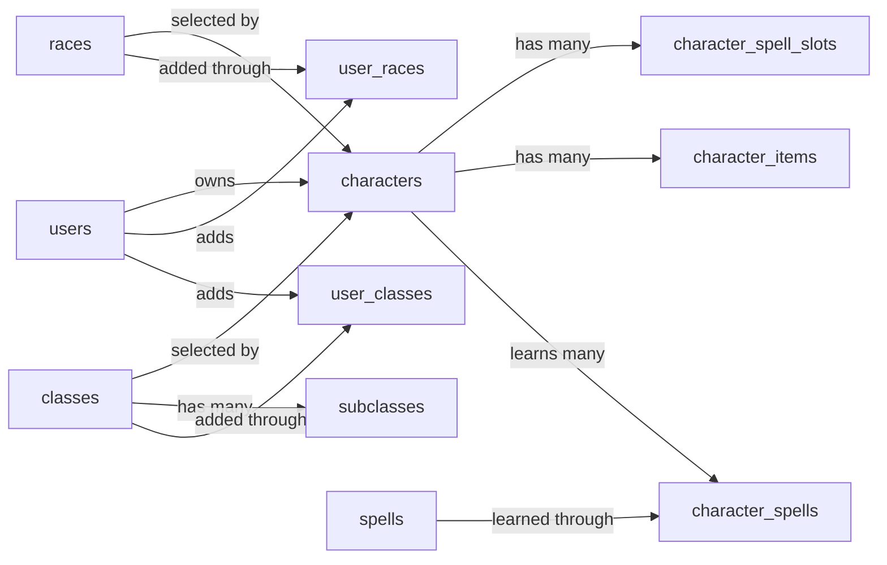

# Database Schema

Supabase (PostgreSQL) schema for the D&D mobile app.

## Overview

The app stores user accounts, character sheets, reusable character catalogs, and a shared spell catalog in a single Supabase project.

| Table | Purpose |
| ----- | ------- |
| `users` | User accounts. Default-user today, Google/Apple OAuth later. |
| `races` | Searchable catalog of official and custom races. |
| `classes` | Searchable catalog of official and custom classes. |
| `subclasses` | Subclass options grouped under each class. |
| `user_races` | Races a user has added to their account. |
| `user_classes` | Classes a user has added to their account. |
| `characters` | One row per character, owned by a user. |
| `character_spell_slots` | Per-character spell slot pools by level. |
| `character_items` | Inventory items owned by a character. |
| `spells` | Shared spell catalog. |
| `character_spells` | Many-to-many learned-spell links between characters and spells. |

### Authentication state

- **Now (early development):** the database holds a single seeded "default" user. The mobile app has no login screen and every read/write uses this user's `id`.
- **Later:** Google and Apple OAuth become the only ways to sign up and log in. Each successful OAuth sign-up creates a new `users` row. Supabase natively supports both providers for Expo via `supabase-js`.

## Conventions

- Every entity table has an `id` of type `UUID` with a default of `gen_random_uuid()`.
- Every mutable entity table has `created_at` and `updated_at` columns of type `TIMESTAMPTZ NOT NULL DEFAULT now()`.
- `updated_at` is kept current by the shared `update_updated_at()` trigger.
- Column names use `snake_case`.
- Stable value sets use PostgreSQL enums. User-extensible values, such as races and classes, use tables.
- Computed game values (saving-throw totals, skill modifiers, etc.) are **not** stored. They are derived in app code from ability scores, level, and proficiency lists. Only the inputs are persisted.
- Row-level security (RLS) is enabled on every table in the exposed `public` schema.

## Entity relationships



- A `user` has many `characters`.
- A `character` chooses one `race` and one `class`.
- A `class` has many `subclasses`.
- A `character` has many `character_spell_slots`, `character_items`, and `character_spells`.
- A `spell` can be learned by many characters via `character_spells`.
- `races` and `classes` are searchable catalogs. Official rows are global. Custom rows can be found and added to a user's account via `user_races` and `user_classes`.

## Shared infrastructure

### Enum types

```sql
CREATE TYPE auth_provider AS ENUM ('default', 'google', 'apple');

CREATE TYPE ability_score AS ENUM ('STR', 'DEX', 'CON', 'INT', 'WIS', 'CHA');

CREATE TYPE skill_name AS ENUM (
  'Acrobatics',
  'Animal Handling',
  'Arcana',
  'Athletics',
  'Deception',
  'History',
  'Insight',
  'Intimidation',
  'Investigation',
  'Medicine',
  'Nature',
  'Perception',
  'Performance',
  'Persuasion',
  'Religion',
  'Sleight of Hand',
  'Stealth',
  'Survival'
);

CREATE TYPE alignment AS ENUM (
  'lawful_good',
  'neutral_good',
  'chaotic_good',
  'lawful_neutral',
  'true_neutral',
  'chaotic_neutral',
  'lawful_evil',
  'neutral_evil',
  'chaotic_evil'
);

CREATE TYPE item_transfer_status AS ENUM ('pending', 'consumed', 'expired');
```

`races` and `classes` are intentionally tables, not enums, because players can create custom entries.

### `update_updated_at()` trigger function

Applied to mutable tables so `updated_at` is refreshed on `UPDATE`.

```sql
CREATE OR REPLACE FUNCTION update_updated_at()
RETURNS TRIGGER AS $$
BEGIN
  NEW.updated_at = now();
  RETURN NEW;
END;
$$ LANGUAGE plpgsql;
```

Attach to each mutable table with:

```sql
CREATE TRIGGER set_updated_at
  BEFORE UPDATE ON <table>
  FOR EACH ROW EXECUTE FUNCTION update_updated_at();
```

## `users`

```sql
CREATE TABLE users (
  id               UUID PRIMARY KEY DEFAULT gen_random_uuid(),
  auth_provider    auth_provider NOT NULL,
  auth_provider_id TEXT,
  email            TEXT,
  display_name     TEXT NOT NULL,
  avatar_url       TEXT,
  created_at       TIMESTAMPTZ NOT NULL DEFAULT now(),
  updated_at       TIMESTAMPTZ NOT NULL DEFAULT now()
);

CREATE TRIGGER set_updated_at
  BEFORE UPDATE ON users
  FOR EACH ROW EXECUTE FUNCTION update_updated_at();
```

### Column notes

- `auth_provider` - how the account was created. `'default'` is reserved for the seeded development user. Once OAuth is live, only `'google'` and `'apple'` are accepted by the app.
- `auth_provider_id` - the user's unique id at the OAuth provider (Google `sub`, Apple `sub`). `NULL` only for the default user.
- `email` / `avatar_url` - taken from the provider when available. May be `NULL` if the provider does not supply them.
- `display_name` - required for every user; UI fallback when no avatar is available.

### Indexes

```sql
CREATE UNIQUE INDEX users_provider_unique
  ON users (auth_provider, auth_provider_id)
  WHERE auth_provider_id IS NOT NULL;
```

The partial index keeps the default user (`auth_provider_id IS NULL`) from blocking future OAuth inserts that share `NULL`.

### Default-user seed

```sql
INSERT INTO users (id, auth_provider, auth_provider_id, email, display_name, avatar_url)
VALUES (
  '00000000-0000-0000-0000-000000000001',
  'default',
  NULL,
  NULL,
  'Default Adventurer',
  NULL
);
```

The mobile app keeps this `id` in a config constant and uses it for every query until OAuth is wired up.

### RLS policies

```sql
ALTER TABLE users ENABLE ROW LEVEL SECURITY;

CREATE POLICY users_select_own ON users
  FOR SELECT USING (id = auth.uid());

CREATE POLICY users_update_own ON users
  FOR UPDATE USING (id = auth.uid());
```

## `races`

Searchable catalog of official and custom races. Players can search custom races and add selected rows to their account.

```sql
CREATE TABLE races (
  id                 UUID PRIMARY KEY DEFAULT gen_random_uuid(),
  name               TEXT NOT NULL,
  short_description  TEXT NOT NULL,
  is_official        BOOLEAN NOT NULL DEFAULT false,
  created_by_user_id UUID REFERENCES users(id) ON DELETE SET NULL,
  created_at         TIMESTAMPTZ NOT NULL DEFAULT now(),
  updated_at         TIMESTAMPTZ NOT NULL DEFAULT now()
);

CREATE TRIGGER set_updated_at
  BEFORE UPDATE ON races
  FOR EACH ROW EXECUTE FUNCTION update_updated_at();
```

### Indexes

```sql
CREATE INDEX races_name_idx ON races (lower(name));

CREATE UNIQUE INDEX races_official_name_unique
  ON races (lower(name))
  WHERE is_official;
```

Official race names are unique. Custom race names are allowed to collide because different players may create similar homebrew.

### RLS policies

```sql
ALTER TABLE races ENABLE ROW LEVEL SECURITY;

CREATE POLICY races_select_authenticated ON races
  FOR SELECT USING (auth.role() = 'authenticated');

CREATE POLICY races_insert_custom ON races
  FOR INSERT WITH CHECK (
    auth.role() = 'authenticated'
    AND created_by_user_id = auth.uid()
    AND is_official = false
  );

CREATE POLICY races_update_own_custom ON races
  FOR UPDATE USING (
    created_by_user_id = auth.uid()
    AND is_official = false
  );

CREATE POLICY races_delete_own_custom ON races
  FOR DELETE USING (
    created_by_user_id = auth.uid()
    AND is_official = false
  );
```

Official rows are seeded/admin-managed. Custom rows are readable by authenticated users so players can search and add them.

## `classes`

Searchable catalog of official and custom classes. Players can search custom classes and add selected rows to their account.

```sql
CREATE TABLE classes (
  id                 UUID PRIMARY KEY DEFAULT gen_random_uuid(),
  name               TEXT NOT NULL,
  short_description  TEXT NOT NULL,
  subclass_level     SMALLINT NOT NULL DEFAULT 3 CHECK (subclass_level BETWEEN 1 AND 20),
  is_official        BOOLEAN NOT NULL DEFAULT false,
  created_by_user_id UUID REFERENCES users(id) ON DELETE SET NULL,
  created_at         TIMESTAMPTZ NOT NULL DEFAULT now(),
  updated_at         TIMESTAMPTZ NOT NULL DEFAULT now()
);

CREATE TRIGGER set_updated_at
  BEFORE UPDATE ON classes
  FOR EACH ROW EXECUTE FUNCTION update_updated_at();
```

### Indexes

```sql
CREATE INDEX classes_name_idx ON classes (lower(name));

CREATE UNIQUE INDEX classes_official_name_unique
  ON classes (lower(name))
  WHERE is_official;
```

Official class names are unique. Custom class names are allowed to collide.

## `subclasses`

Subclass catalog grouped by class.

```sql
CREATE TABLE subclasses (
  class_id           UUID NOT NULL REFERENCES classes(id) ON DELETE CASCADE,
  subclass_id        UUID NOT NULL DEFAULT gen_random_uuid(),
  name               TEXT NOT NULL,
  short_description  TEXT NOT NULL,
  PRIMARY KEY (class_id, subclass_id)
);

CREATE INDEX subclasses_class_id_idx ON subclasses (class_id);
CREATE INDEX subclasses_name_idx ON subclasses (lower(name));
```

### RLS policies

```sql
ALTER TABLE classes ENABLE ROW LEVEL SECURITY;

CREATE POLICY classes_select_authenticated ON classes
  FOR SELECT USING (auth.role() = 'authenticated');

CREATE POLICY classes_insert_custom ON classes
  FOR INSERT WITH CHECK (
    auth.role() = 'authenticated'
    AND created_by_user_id = auth.uid()
    AND is_official = false
  );

CREATE POLICY classes_update_own_custom ON classes
  FOR UPDATE USING (
    created_by_user_id = auth.uid()
    AND is_official = false
  );

CREATE POLICY classes_delete_own_custom ON classes
  FOR DELETE USING (
    created_by_user_id = auth.uid()
    AND is_official = false
  );

ALTER TABLE subclasses ENABLE ROW LEVEL SECURITY;

CREATE POLICY subclasses_select_authenticated ON subclasses
  FOR SELECT USING (auth.role() = 'authenticated');
```

## `user_races`

Join table for races added to a user's account.

```sql
CREATE TABLE user_races (
  user_id  UUID NOT NULL REFERENCES users(id) ON DELETE CASCADE,
  race_id  UUID NOT NULL REFERENCES races(id) ON DELETE CASCADE,
  added_at TIMESTAMPTZ NOT NULL DEFAULT now(),
  PRIMARY KEY (user_id, race_id)
);

CREATE INDEX user_races_race_id_idx ON user_races (race_id);
```

### RLS policies

```sql
ALTER TABLE user_races ENABLE ROW LEVEL SECURITY;

CREATE POLICY user_races_select_own ON user_races
  FOR SELECT USING (user_id = auth.uid());

CREATE POLICY user_races_insert_own ON user_races
  FOR INSERT WITH CHECK (user_id = auth.uid());

CREATE POLICY user_races_delete_own ON user_races
  FOR DELETE USING (user_id = auth.uid());
```

## `user_classes`

Join table for classes added to a user's account.

```sql
CREATE TABLE user_classes (
  user_id  UUID NOT NULL REFERENCES users(id) ON DELETE CASCADE,
  class_id UUID NOT NULL REFERENCES classes(id) ON DELETE CASCADE,
  added_at TIMESTAMPTZ NOT NULL DEFAULT now(),
  PRIMARY KEY (user_id, class_id)
);

CREATE INDEX user_classes_class_id_idx ON user_classes (class_id);
```

### RLS policies

```sql
ALTER TABLE user_classes ENABLE ROW LEVEL SECURITY;

CREATE POLICY user_classes_select_own ON user_classes
  FOR SELECT USING (user_id = auth.uid());

CREATE POLICY user_classes_insert_own ON user_classes
  FOR INSERT WITH CHECK (user_id = auth.uid());

CREATE POLICY user_classes_delete_own ON user_classes
  FOR DELETE USING (user_id = auth.uid());
```

## `characters`

One row per character. One-to-one character sheet fields are stored directly as SQL columns.

```sql
CREATE TABLE characters (
  id                 UUID PRIMARY KEY DEFAULT gen_random_uuid(),
  user_id            UUID NOT NULL REFERENCES users(id) ON DELETE CASCADE,
  race_id            UUID NOT NULL REFERENCES races(id),
  class_id           UUID NOT NULL REFERENCES classes(id),
  subclass_id        UUID,
  name               TEXT NOT NULL,
  photo_uri          TEXT,
  str_score          SMALLINT NOT NULL CHECK (str_score BETWEEN 1 AND 30),
  dex_score          SMALLINT NOT NULL CHECK (dex_score BETWEEN 1 AND 30),
  con_score          SMALLINT NOT NULL CHECK (con_score BETWEEN 1 AND 30),
  int_score          SMALLINT NOT NULL CHECK (int_score BETWEEN 1 AND 30),
  wis_score          SMALLINT NOT NULL CHECK (wis_score BETWEEN 1 AND 30),
  cha_score          SMALLINT NOT NULL CHECK (cha_score BETWEEN 1 AND 30),
  proficient_saves   ability_score[] NOT NULL DEFAULT '{}',
  proficient_skills  skill_name[] NOT NULL DEFAULT '{}',
  hp_current         INTEGER NOT NULL CHECK (hp_current >= 0),
  hp_max             INTEGER NOT NULL CHECK (hp_max >= 0),
  hp_temp            INTEGER NOT NULL DEFAULT 0 CHECK (hp_temp >= 0),
  proficiency_bonus  SMALLINT NOT NULL CHECK (proficiency_bonus >= 0),
  armor_class        SMALLINT NOT NULL CHECK (armor_class >= 0),
  inspiration        SMALLINT NOT NULL DEFAULT 0 CHECK (inspiration >= 0),
  initiative         SMALLINT NOT NULL,
  speed              SMALLINT NOT NULL CHECK (speed >= 0),
  level              SMALLINT NOT NULL CHECK (level BETWEEN 1 AND 20),
  experience         INTEGER NOT NULL DEFAULT 0 CHECK (experience >= 0),
  alignment          alignment NOT NULL,
  gender             TEXT NOT NULL,
  eyes               TEXT NOT NULL,
  size               TEXT NOT NULL,
  height             TEXT NOT NULL,
  age                INTEGER NOT NULL CHECK (age >= 0),
  faith              TEXT NOT NULL,
  skin               TEXT NOT NULL,
  background         TEXT NOT NULL,
  personality_traits TEXT NOT NULL,
  bonds              TEXT NOT NULL,
  ideals             TEXT NOT NULL,
  flaws              TEXT NOT NULL,
  gold               INTEGER NOT NULL DEFAULT 0 CHECK (gold >= 0),
  silver             INTEGER NOT NULL DEFAULT 0 CHECK (silver >= 0),
  copper             INTEGER NOT NULL DEFAULT 0 CHECK (copper >= 0),
  created_at         TIMESTAMPTZ NOT NULL DEFAULT now(),
  updated_at         TIMESTAMPTZ NOT NULL DEFAULT now(),
  FOREIGN KEY (class_id, subclass_id) REFERENCES subclasses(class_id, subclass_id)
);

CREATE TRIGGER set_updated_at
  BEFORE UPDATE ON characters
  FOR EACH ROW EXECUTE FUNCTION update_updated_at();

CREATE INDEX characters_user_id_idx ON characters (user_id);
CREATE INDEX characters_race_id_idx ON characters (race_id);
CREATE INDEX characters_class_id_idx ON characters (class_id);
CREATE INDEX characters_subclass_id_idx ON characters (subclass_id);
```

### Column notes

- `race_id` / `class_id` - selected catalog rows. The app should only allow official rows or rows added to the user's account through `user_races` / `user_classes`.
- `subclass_id` - optional at character creation. When present, it must belong to the selected `class_id`.
- `name`, `photo_uri` - header data shown on the character sheet.
- `*_score` - raw ability scores 1-30. Ability modifiers are computed in app code via `Math.floor((score - 10) / 2)`.
- `proficient_saves` - enum array of ability saves for which the character is proficient.
- `proficient_skills` - enum array of proficient skill names.
- `hp_current`, `hp_max`, `hp_temp` - current hit points, maximum hit points, and temporary hit points.
- `proficiency_bonus` - stored to allow homebrew or feature-driven overrides.
- `armor_class`, `inspiration`, `initiative`, `speed` - sheet stats stored as final values.
- `alignment` - one of the nine D&D alignments: `lawful_good`, `neutral_good`, `chaotic_good`, `lawful_neutral`, `true_neutral`, `chaotic_neutral`, `lawful_evil`, `neutral_evil`, `chaotic_evil`.
- `gold`, `silver`, `copper` - coin counts. Currency stays on `characters` because it is one-to-one character state.

### RLS policies

```sql
ALTER TABLE characters ENABLE ROW LEVEL SECURITY;

CREATE POLICY characters_select_own ON characters
  FOR SELECT USING (user_id = auth.uid());

CREATE POLICY characters_insert_own ON characters
  FOR INSERT WITH CHECK (
    user_id = auth.uid()
    AND (
      EXISTS (
        SELECT 1 FROM races
        WHERE races.id = race_id
          AND races.is_official = true
      )
      OR EXISTS (
        SELECT 1 FROM user_races
        WHERE user_races.user_id = auth.uid()
          AND user_races.race_id = race_id
      )
    )
    AND (
      EXISTS (
        SELECT 1 FROM classes
        WHERE classes.id = class_id
          AND classes.is_official = true
      )
      OR EXISTS (
        SELECT 1 FROM user_classes
        WHERE user_classes.user_id = auth.uid()
          AND user_classes.class_id = class_id
      )
    )
  );

CREATE POLICY characters_update_own ON characters
  FOR UPDATE USING (user_id = auth.uid())
  WITH CHECK (user_id = auth.uid());

CREATE POLICY characters_delete_own ON characters
  FOR DELETE USING (user_id = auth.uid());
```

## `character_spell_slots`

Per-character spell slot pool. Cantrips (`level = 0`) are not represented because they do not consume slots.

```sql
CREATE TABLE character_spell_slots (
  character_id UUID NOT NULL REFERENCES characters(id) ON DELETE CASCADE,
  level        SMALLINT NOT NULL CHECK (level BETWEEN 1 AND 9),
  current      SMALLINT NOT NULL CHECK (current >= 0),
  max          SMALLINT NOT NULL CHECK (max >= 0),
  PRIMARY KEY (character_id, level),
  CHECK (current <= max)
);
```

### Column notes

- `character_id` - owning character.
- `level` - spell slot tier, `1`-`9`. Each character can have at most one row per level.
- `current` - unspent slots remaining.
- `max` - total slots at that level.

### RLS policies

```sql
ALTER TABLE character_spell_slots ENABLE ROW LEVEL SECURITY;

CREATE POLICY character_spell_slots_select_own ON character_spell_slots
  FOR SELECT USING (
    EXISTS (
      SELECT 1 FROM characters
      WHERE characters.id = character_id
        AND characters.user_id = auth.uid()
    )
  );

CREATE POLICY character_spell_slots_insert_own ON character_spell_slots
  FOR INSERT WITH CHECK (
    EXISTS (
      SELECT 1 FROM characters
      WHERE characters.id = character_id
        AND characters.user_id = auth.uid()
    )
  );

CREATE POLICY character_spell_slots_update_own ON character_spell_slots
  FOR UPDATE USING (
    EXISTS (
      SELECT 1 FROM characters
      WHERE characters.id = character_id
        AND characters.user_id = auth.uid()
    )
  );

CREATE POLICY character_spell_slots_delete_own ON character_spell_slots
  FOR DELETE USING (
    EXISTS (
      SELECT 1 FROM characters
      WHERE characters.id = character_id
        AND characters.user_id = auth.uid()
    )
  );
```

## `character_items`

Inventory items owned by a character.

```sql
CREATE TABLE character_items (
  id                  UUID PRIMARY KEY DEFAULT gen_random_uuid(),
  character_id        UUID NOT NULL REFERENCES characters(id) ON DELETE CASCADE,
  name                TEXT NOT NULL,
  description         TEXT NOT NULL,
  requires_attunement BOOLEAN NOT NULL DEFAULT false,
  attuned             BOOLEAN NOT NULL DEFAULT false,
  created_at          TIMESTAMPTZ NOT NULL DEFAULT now(),
  updated_at          TIMESTAMPTZ NOT NULL DEFAULT now(),
  CHECK (requires_attunement OR NOT attuned)
);

CREATE TRIGGER set_updated_at
  BEFORE UPDATE ON character_items
  FOR EACH ROW EXECUTE FUNCTION update_updated_at();

CREATE INDEX character_items_character_id_idx ON character_items (character_id);
```

### Column notes

- `character_id` - owning character.
- `name`, `description` - item details.
- `requires_attunement` - whether the item requires attunement at all.
- `attuned` - whether the character is currently attuned to the item.

The table-level CHECK prevents `attuned = true` when `requires_attunement = false`. The D&D cap of at most 3 attuned items per character is enforced in app code before persisting.

### RLS policies

```sql
ALTER TABLE character_items ENABLE ROW LEVEL SECURITY;

CREATE POLICY character_items_select_own ON character_items
  FOR SELECT USING (
    EXISTS (
      SELECT 1 FROM characters
      WHERE characters.id = character_id
        AND characters.user_id = auth.uid()
    )
  );

CREATE POLICY character_items_insert_own ON character_items
  FOR INSERT WITH CHECK (
    EXISTS (
      SELECT 1 FROM characters
      WHERE characters.id = character_id
        AND characters.user_id = auth.uid()
    )
  );

CREATE POLICY character_items_update_own ON character_items
  FOR UPDATE USING (
    EXISTS (
      SELECT 1 FROM characters
      WHERE characters.id = character_id
        AND characters.user_id = auth.uid()
    )
  );

CREATE POLICY character_items_delete_own ON character_items
  FOR DELETE USING (
    EXISTS (
      SELECT 1 FROM characters
      WHERE characters.id = character_id
        AND characters.user_id = auth.uid()
    )
  );
```

## `spells`

Shared catalog. One row per spell, readable by all authenticated users.

```sql
CREATE TABLE spells (
  id           UUID PRIMARY KEY DEFAULT gen_random_uuid(),
  name         TEXT NOT NULL UNIQUE,
  level        SMALLINT NOT NULL CHECK (level BETWEEN 0 AND 9),
  casting_time TEXT NOT NULL,
  range        TEXT NOT NULL,
  duration     TEXT NOT NULL,
  rolls        TEXT NOT NULL DEFAULT 'NA',
  concentration BOOLEAN NOT NULL DEFAULT false,
  description  TEXT NOT NULL,
  created_at   TIMESTAMPTZ NOT NULL DEFAULT now(),
  updated_at   TIMESTAMPTZ NOT NULL DEFAULT now()
);

CREATE TRIGGER set_updated_at
  BEFORE UPDATE ON spells
  FOR EACH ROW EXECUTE FUNCTION update_updated_at();

CREATE INDEX spells_level_idx ON spells (level);
```

### Column notes

- `name` - globally unique in the catalog.
- `level` - `0` for cantrips, otherwise `1`-`9`.
- `casting_time`, `range`, `duration` - human-readable rules text such as `1 bonus action`, `Self (30-foot cone)`, or `Concentration, up to 1 minute`.
- `rolls` - dice expression used by the app to highlight spell effects such as damage or healing, e.g. `4d6`. Use `NA` when no roll applies.
- `concentration` - whether the spell requires concentration.
- `description` - full rules text.

### RLS policies

```sql
ALTER TABLE spells ENABLE ROW LEVEL SECURITY;

CREATE POLICY spells_select_authenticated ON spells
  FOR SELECT USING (auth.role() = 'authenticated');
```

## `character_spells`

Many-to-many table for spells learned by a character.

```sql
CREATE TABLE character_spells (
  character_id    UUID NOT NULL REFERENCES characters(id) ON DELETE CASCADE,
  spell_id        UUID NOT NULL REFERENCES spells(id) ON DELETE CASCADE,
  prepared        BOOLEAN NOT NULL DEFAULT false,
  always_prepared BOOLEAN NOT NULL DEFAULT false,
  created_at      TIMESTAMPTZ NOT NULL DEFAULT now(),
  updated_at      TIMESTAMPTZ NOT NULL DEFAULT now(),
  PRIMARY KEY (character_id, spell_id)
);

CREATE TRIGGER set_updated_at
  BEFORE UPDATE ON character_spells
  FOR EACH ROW EXECUTE FUNCTION update_updated_at();

CREATE INDEX character_spells_spell_id_idx ON character_spells (spell_id);
```

### Column notes

- `character_id` - owning character.
- `spell_id` - learned spell.
- `prepared` - whether the spell is currently prepared.
- `always_prepared` - `true` for spells that bypass the prepared count, such as domain, oath, or racial spells.

### RLS policies

```sql
ALTER TABLE character_spells ENABLE ROW LEVEL SECURITY;

CREATE POLICY character_spells_select_own ON character_spells
  FOR SELECT USING (
    EXISTS (
      SELECT 1 FROM characters
      WHERE characters.id = character_id
        AND characters.user_id = auth.uid()
    )
  );

CREATE POLICY character_spells_insert_own ON character_spells
  FOR INSERT WITH CHECK (
    EXISTS (
      SELECT 1 FROM characters
      WHERE characters.id = character_id
        AND characters.user_id = auth.uid()
    )
  );

CREATE POLICY character_spells_update_own ON character_spells
  FOR UPDATE USING (
    EXISTS (
      SELECT 1 FROM characters
      WHERE characters.id = character_id
        AND characters.user_id = auth.uid()
    )
  );

CREATE POLICY character_spells_delete_own ON character_spells
  FOR DELETE USING (
    EXISTS (
      SELECT 1 FROM characters
      WHERE characters.id = character_id
        AND characters.user_id = auth.uid()
    )
  );
```

## Common queries

### Races and classes visible to a user

Official rows are always visible. Custom rows become account options after the user adds them.

```sql
SELECT races.*
FROM races
WHERE races.is_official = true
   OR EXISTS (
      SELECT 1 FROM user_races
      WHERE user_races.user_id = :user_id
        AND user_races.race_id = races.id
   )
ORDER BY races.name;
```

Use the same pattern for `classes` and `user_classes`.

### Full character sheet

Fetch the base `characters` row, then related rows from:

- `races`
- `classes`
- `character_spell_slots`
- `character_items`
- `character_spells` joined to `spells`

Supabase can return nested related data through foreign-key relationships, or the app can issue separate focused queries per section.

## Planned features

### QR-code item transfer

Players will be able to hand items to each other in person by having one player generate a QR code and the other scan it.

Sketch of the flow:

1. **Sender** picks a row from `character_items` and taps "transfer". The app creates a short-lived `item_transfers` row with the item id, an item snapshot, and a one-time token, then renders a QR code containing that token.
2. **Receiver** scans the QR code. The app validates the token against `item_transfers` and runs an atomic transfer:

   ```sql
   UPDATE character_items
   SET character_id = :receiver_character_id,
       attuned = false
   WHERE id = :item_id
     AND character_id = :sender_character_id;
   ```

3. The `item_transfers` row is marked `consumed` so the QR cannot be reused.

Planned `item_transfers` table (not implemented yet):

```sql
CREATE TABLE item_transfers (
  id                       UUID PRIMARY KEY DEFAULT gen_random_uuid(),
  token                    TEXT NOT NULL UNIQUE,
  item_id                  UUID NOT NULL REFERENCES character_items(id),
  from_user_id             UUID NOT NULL REFERENCES users(id),
  from_character_id        UUID NOT NULL REFERENCES characters(id),
  item_snapshot            JSONB NOT NULL,
  status                   item_transfer_status NOT NULL DEFAULT 'pending',
  expires_at               TIMESTAMPTZ NOT NULL,
  created_at               TIMESTAMPTZ NOT NULL DEFAULT now(),
  updated_at               TIMESTAMPTZ NOT NULL DEFAULT now(),
  consumed_at              TIMESTAMPTZ,
  consumed_by_user_id      UUID REFERENCES users(id),
  consumed_by_character_id UUID REFERENCES characters(id)
);

CREATE TRIGGER set_updated_at
  BEFORE UPDATE ON item_transfers
  FOR EACH ROW EXECUTE FUNCTION update_updated_at();

CREATE INDEX item_transfers_expires_at_idx ON item_transfers (expires_at);
CREATE INDEX item_transfers_item_id_idx ON item_transfers (item_id);
```

`item_snapshot` remains JSONB intentionally. Transfer history should preserve what was shown in the QR flow even if the live `character_items` row changes later.

**TTL expiry:** PostgreSQL has no native TTL index. Expired rows can be cleaned up via a `pg_cron` scheduled job or handled in app code before reads.

**RLS policies (when added):**

```sql
ALTER TABLE item_transfers ENABLE ROW LEVEL SECURITY;

CREATE POLICY item_transfers_sender_select ON item_transfers
  FOR SELECT USING (from_user_id = auth.uid());

CREATE POLICY item_transfers_sender_insert ON item_transfers
  FOR INSERT WITH CHECK (from_user_id = auth.uid());

CREATE POLICY item_transfers_receiver_select ON item_transfers
  FOR SELECT USING (consumed_by_user_id = auth.uid());
```

Notes:

- The transfer table is separate from `character_items` so the app has an audit trail and a natural place to store short-lived QR tokens.
- `attuned` is reset on transfer because 5e rules require the new owner to attune themselves.

## Follow-ups (out of scope for this document)

- Install and configure `supabase-js` inside the Expo app.
- Seed scripts for the default user, official races, official classes, and the initial spells catalog.
- Repository / data-access layer to replace the mock `*Service` files in `services/`.
- Google and Apple OAuth integration via Supabase Auth (sign-up, sign-in, account linking).
- Class-feature data (currently a static registry in `services/ClassService.ts`); promote to tables when needed.
- `item_transfers` table and the QR-code transfer flow described under [Planned features](#qr-code-item-transfer).
- `pg_cron` job for expiring stale `item_transfers` rows.
