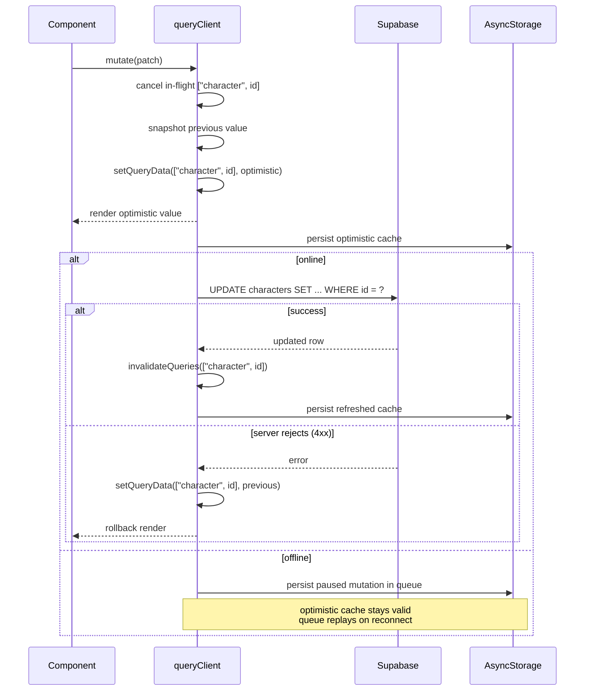
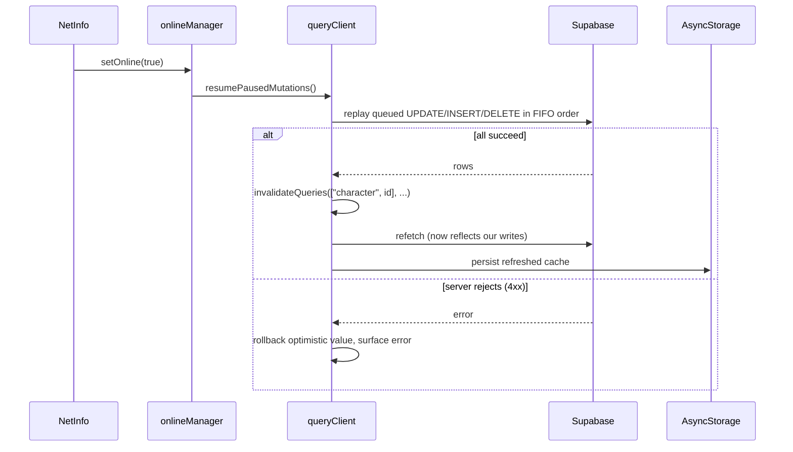
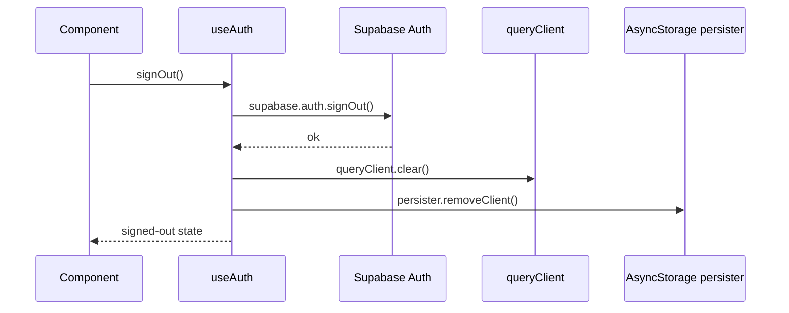

# Local state and sync

This document describes how the mobile app caches server data on-device, keeps the UI snappy after writes, and stays consistent with `public.*` tables in Supabase. It is the companion to [db-schema.md](db-schema.md): the schema doc says what is stored on the server, this doc says what is mirrored on the device and how.

## Goals

- **Instant cold-start render.** When the app reopens, the previous user-visible data appears before any network call returns.
- **Optimistic writes.** A character edit feels immediate; the network request happens in the background, and a server failure rolls the cache back.
- **Offline writes.** Mutations succeed immediately against the optimistic cache; the network call is paused while offline and replayed on reconnect. The UI never blocks on the network.
- **No PII leak across users.** Cached data is wiped on sign-out before any other user could read it on a shared device.
- **Hook-only data layer.** Every read and write goes through a hook under `hooks/data/`; the mock `services/*Service.ts` files are deleted. There is no separate repository or service abstraction.

## Assumptions

- **Single device per character at a time.** A character is edited from one device at a time. We do not handle the "device A queued offline writes while device B already pushed newer rows" scenario.
- **No client-side merge.** On reconnect, the offline mutation queue is replayed first and then queries refetch — whatever the queue produced is treated as authoritative. There is no `If-Match`, no version comparison, no per-field timestamp diff.
- These constraints are what let us keep last-writer-wins and skip Realtime fan-out today; revisit once shared or multi-device editing actually ships (see [Future work](#future-work)).

## Storage stack

Two layers, both backed by AsyncStorage:

- **Auth session** — managed entirely by `@supabase/supabase-js`. Configured in [`lib/supabase.ts`](../lib/supabase.ts) with `storage: AsyncStorage`. Tokens auto-refresh and survive app restarts.
- **React Query cache** — `@tanstack/react-query` holds server state in memory; `@tanstack/react-query-persist-client` + `@tanstack/query-async-storage-persister` dehydrate the cache to AsyncStorage after every mutation and rehydrate it on app start. The persister also dehydrates *paused* mutations, so a write queued while offline survives a force-quit and is replayed on the next launch once connectivity returns. Configured in [`lib/queryClient.ts`](../lib/queryClient.ts) and wired up in [`app/_layout.tsx`](../app/_layout.tsx) via `<PersistQueryClientProvider>`.

### Why this stack

- **TanStack Query** already covers stale-while-revalidate, optimistic updates, retries, and persistence in a small package. A hand-rolled Zustand store would re-implement most of it.
- **AsyncStorage** is async, simple, and already required for Supabase session persistence — no extra native modules.
- **MMKV** is faster (synchronous, native) but adds native build complexity. Worth revisiting if profiling shows AsyncStorage is a hot spot, e.g. very frequent reads on a list screen.
- **SQLite** is the right answer once we need offline querying across many rows, large blobs (>2 MB), or relational reads that the app has to do without a round trip. Not needed for the current single-active-character pattern.

The persister storage can be swapped (e.g. to MMKV) without changing component code — only `lib/queryClient.ts` would change.

## Cache key schema

| Cache key | Source | Notes |
| --- | --- | --- |
| `["users", userId]` | `public.users` | Driven by [`hooks/data/useCurrentUser.ts`](../hooks/data/useCurrentUser.ts). Prefetched on `SIGNED_IN` by `useAuth`. |
| `["character", characterId]` | `public.characters` | Whole character row. Ability scores, HP, AC, money, biometrics (`alignment`, `gender`, `eyes`, …) and narrative arrays (`personality_traits`, `bonds`, `ideals`, `flaws`) all live here — there is no separate cache key for any of these. |
| `["character", characterId, "features"]` | `public.v_character_features` | Resolved feature list for the character. |
| `["character", characterId, "items"]` | `public.character_items` | Inventory rows. |
| `["character", characterId, "spells"]` | `public.character_spells` ⨝ `public.spells` | Learned spells with their catalog metadata. |
| `["character", characterId, "spellSlots"]` | `public.character_spell_slots` | Per-level spell slot pool. |
| `["catalog", "races"]` | `public.races` | Read-only catalog. 24 h `staleTime`; persisted across launches so it stays available offline. |
| `["catalog", "classes"]` | `public.classes` (joined with `public.subclasses`) | Read-only catalog. 24 h `staleTime`. |
| `["catalog", "features"]` | `public.features` | Read-only catalog used by the level-up UI. 24 h `staleTime`. |
| `["catalog", "spells"]` | `public.spells` | Read-only spell catalog. 24 h `staleTime`. |

### Invalidation rules

- A write touches the **narrowest matching key** first (e.g. updating `hp_current` invalidates `["character", characterId]`).
- Cross-cutting writes (level-up, multiclass) touch the parent and all sibling keys. The mutation hook is responsible for invalidating each.
- Readers always use the cache key documented here, never ad-hoc keys, so invalidation stays predictable.
- Derived views (saving throws, skills, biometrics, narrative values) are computed in-component from `["character", characterId]` and the relevant `["catalog", …]` slice. They never get their own cache key, so they cannot drift from the row they're derived from.

## Online state

Connectivity is reported to React Query through `onlineManager`, fed by [@react-native-community/netinfo](https://github.com/react-native-netinfo/react-native-netinfo). The wiring lives in [`lib/queryClient.ts`](../lib/queryClient.ts):

```ts
import NetInfo from "@react-native-community/netinfo";
import { onlineManager } from "@tanstack/react-query";

onlineManager.setEventListener((setOnline) =>
    NetInfo.addEventListener((state) => setOnline(!!state.isConnected)),
);
```

Both queries and mutations run with `networkMode: "offlineFirst"`, set in `defaultOptions` on the `QueryClient`:

- A query started while offline serves the cached value and is automatically refetched when connectivity returns.
- A mutation started while offline runs its `onMutate` (so the optimistic cache update happens immediately) and then **pauses** — the network call is queued instead of throwing. The persister flushes paused mutations to AsyncStorage so the queue survives a force-quit. On reconnect, `onlineManager` triggers `queryClient.resumePausedMutations()` and the queue replays in FIFO order.

## Lifecycles

### Cold start


The Supabase client and `<PersistQueryClientProvider>` independently rehydrate from AsyncStorage. Cached data is rendered **before** any network call returns; the network result swaps in once the query is no longer fresh (`staleTime: 5 min`).

### Mutation (character update)



Implementation lives in [`hooks/data/useUpdateCharacter.ts`](../hooks/data/useUpdateCharacter.ts) and is the canonical template for every character-write hook. Every other write hook (items, spells, spell slots, features) follows the same shape; only the table, the cache key, and the optimistic patch differ.

### Reconnect

When connectivity returns, the offline mutation queue replays *before* any background refetch, so the refetch returns rows that already include the offline edits. There is no client-side merge step.



Because we [assume one device per character](#assumptions), the server never holds newer rows that the queue would clobber, so a successful replay is the final source of truth.

### Sign-out



Both the explicit `signOut()` call and the `SIGNED_OUT` listener in [`hooks/auth/useAuth.ts`](../hooks/auth/useAuth.ts) run the cache-purge step. This is intentional: clearing eagerly prevents any window where the prior user's PII could leak into a new sign-in on a shared device.

`queryClient.clear()` also drops any paused mutations still in the queue. If the user signs out while offline, queued offline edits are lost — that is the deliberate trade-off for guaranteed PII isolation, and the [single-device assumption](#assumptions) makes it acceptable: no other device can later carry those writes.

## Failure handling

- **No network on cold start or mid-session.** Cached data renders immediately. Background refetches wait in the `paused` state until `onlineManager` reports online. Mutations issued while offline run their optimistic update, persist into the queue, and replay on reconnect (see [Reconnect](#reconnect)). The UI may layer an offline indicator on top, but it never blocks.
- **401 mid-session.** Supabase fires `TOKEN_REFRESHED` (auto-handled by the client) or `SIGNED_OUT`; the `useAuth` listener routes the user back to the landing screen and the cache is purged.
- **5xx from Supabase.** Queries retry up to 3 times with exponential backoff (default React Query behaviour). 4xx errors do not retry — the `retry` predicate in `lib/queryClient.ts` short-circuits them.
- **Schema drift.** Bumping `PERSIST_BUSTER` in [`lib/queryClient.ts`](../lib/queryClient.ts) (e.g. `"v1"` → `"v2"`) discards every persisted cache on the next launch. This is the safe default whenever a migration removes or renames a column the cache might hold.

## Hooks

The data layer is hooks-only — every read is a `useQuery` keyed off [Cache key schema](#cache-key-schema), and every write is a `useMutation` shaped like [`hooks/data/useUpdateCharacter.ts`](../hooks/data/useUpdateCharacter.ts) (cancel in-flight → snapshot previous → optimistic `setQueryData` → network → rollback on 4xx → invalidate on settled). The mock `services/*Service.ts` files are deleted as part of the same change.

### Reads

- [`hooks/data/useCurrentUser.ts`](../hooks/data/useCurrentUser.ts) — already implemented. Drives `["users", userId]`.
- `hooks/data/useCharacter.ts` (replaces [`hooks/character/useCharacter.ts`](../hooks/character/useCharacter.ts)) — `useQuery(["character", characterId], …)` against `public.characters`. The single source for HP, ability scores, biometrics, narrative arrays, money, and every other one-to-one column.
- `hooks/data/useCharacterFeatures.ts` (replaces [`hooks/useClassFeatures.ts`](../hooks/useClassFeatures.ts)) — `useQuery(["character", characterId, "features"], …)` against `public.v_character_features`.
- `hooks/data/useCharacterItems.ts` — `useQuery(["character", characterId, "items"], …)` against `public.character_items`.
- `hooks/data/useCharacterSpells.ts` — `useQuery(["character", characterId, "spells"], …)` against `public.character_spells` joined to `public.spells`.
- `hooks/data/useCharacterSpellSlots.ts` — `useQuery(["character", characterId, "spellSlots"], …)` against `public.character_spell_slots`.
- `hooks/data/useCatalog.ts` exports `useRaces`, `useClasses`, `useSpellsCatalog`, `useFeaturesCatalog` against the `["catalog", …]` keys, all with 24 h `staleTime` so the catalogs stay browsable offline.

The following derived hooks are **deleted** — their consumers call `useCharacter` and select the slice in-component, since saving throws, skills, biometrics, and narrative values all live in `["character", characterId]`:

- [`hooks/character/useAbilities.ts`](../hooks/character/useAbilities.ts)
- [`hooks/character/useSavingThrows.ts`](../hooks/character/useSavingThrows.ts)
- [`hooks/character/useBiometrics.ts`](../hooks/character/useBiometrics.ts)
- [`hooks/character/useValues.ts`](../hooks/character/useValues.ts)
- [`hooks/useAbilities.ts`](../hooks/useAbilities.ts) (the `useSkills` export). Skills are computed from `proficient_skills` + each ability's mod + `level`.

### Writes

Every mutation hook follows the optimistic-update pattern and runs with `networkMode: "offlineFirst"` so it queues while offline (see [Online state](#online-state)). All live under `hooks/data/`:

- `useUpdateCharacter` — patch any column on `public.characters`. Already implemented.
- `useCreateCharacterItem`, `useUpdateCharacterItem`, `useDeleteCharacterItem` — `public.character_items`.
- `useLearnSpell`, `useUpdateCharacterSpell`, `useForgetSpell` — `public.character_spells`. `useUpdateCharacterSpell` covers the `prepared` / `always_prepared` toggles.
- `useUpsertSpellSlot`, `useSpendSpellSlot`, `useResetSpellSlots` — `public.character_spell_slots`.
- `useAssignFeature`, `useUnassignFeature` — `public.character_features`.

### Login-time prefetch

[`hooks/auth/useAuth.ts`](../hooks/auth/useAuth.ts) already warms `["users", userId]` on `SIGNED_IN`. Extend the same handler to prefetch the active character's slices in parallel, so every tab (`character-sheet`, `characteristics`, `inventory`, `spells`, `features`) renders from cache on first paint instead of each one launching its own request:

- `["character", characterId]`
- `["character", characterId, "items"]`
- `["character", characterId, "spells"]`
- `["character", characterId, "spellSlots"]`
- `["character", characterId, "features"]`

### Cleanup

- Delete `services/CharacterService.ts`, `services/SkillService.ts`, `services/ClassService.ts`.
- Move any UI-only constants (e.g. `BIOMETRIC_LABELS`, `ABILITY_LABELS`) next to their consumers; drop the `MOCK_*` data wholesale.
- Remove the legacy `hooks/character/` directory and the loose `hooks/useAbilities.ts`, `hooks/useClassFeatures.ts` files once their replacements under `hooks/data/` ship and every screen is wired up.

## Future work

- **Realtime fan-out.** Supabase Realtime can stream row-level changes back to the app. Subscribe per character (`character:id=<characterId>` channel), feed events into `queryClient.setQueryData`. This unlocks live multi-device sync — and at that point the [single-device assumption](#assumptions) above stops holding.
- **Concurrent multi-device edits.** Today the offline queue replays without a merge step because a character is edited from one device at a time. If multi-device editing ever ships (alongside Realtime), add per-row version checks (`updated_at` or a dedicated `version` column) before replaying queued mutations, and skip-or-prompt when the server has moved on.
- **Multi-character selection.** Hooks accept `characterId` directly today. A future characters-list screen would add a persisted selection slot (e.g. `["activeCharacterId", userId]` in AsyncStorage); out of scope while every user has a single active character.
- **Storage migration to MMKV.** The persister API isolates the storage choice. Swap when a profiling pass shows AsyncStorage is a hot spot.
- **Generated types.** Replace `types/db.ts` with the output of the Supabase MCP `generate_typescript_types` tool once the schema stabilises; the cache and hooks will not need to change.
