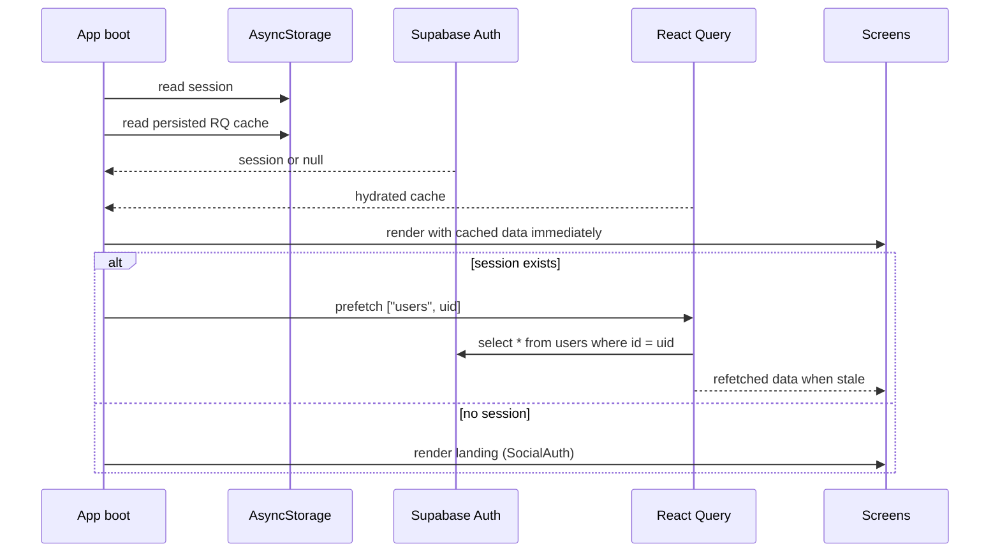
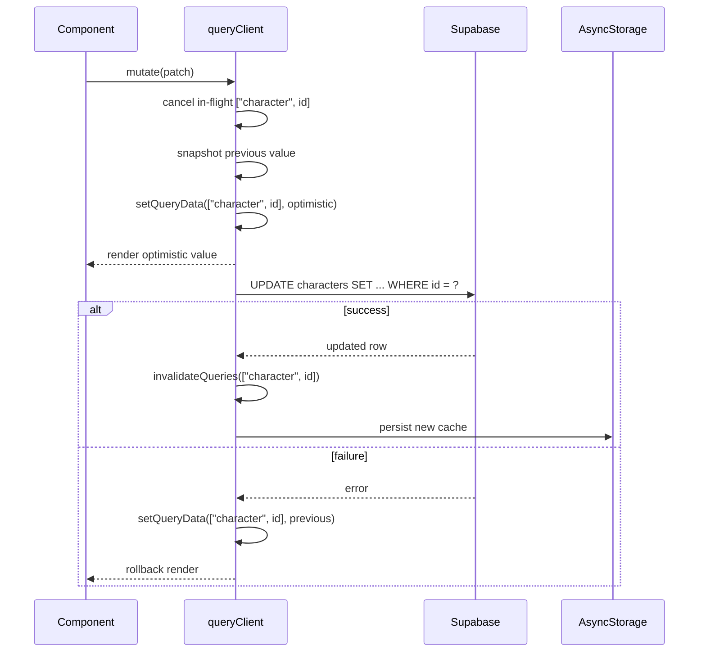
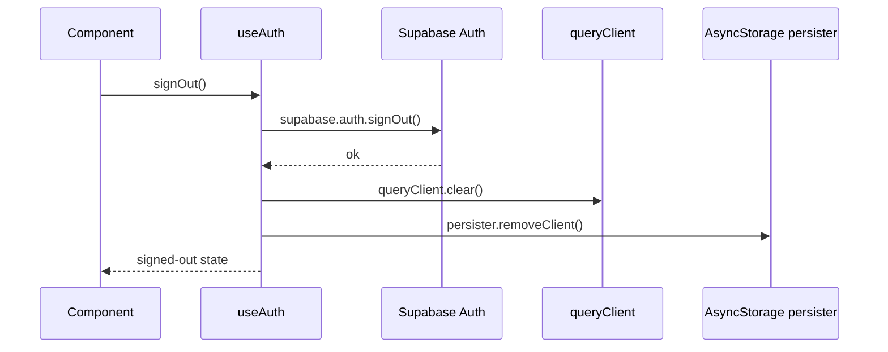

# Local state and sync

This document describes how the mobile app caches server data on-device, keeps the UI snappy after writes, and stays consistent with `public.*` tables in Supabase. It is the companion to [db-schema.md](db-schema.md): the schema doc says what is stored on the server, this doc says what is mirrored on the device and how.

## Goals

- **Instant cold-start render.** When the app reopens, the previous user-visible data appears before any network call returns.
- **Optimistic writes.** A character edit feels immediate; the network request happens in the background, and a server failure rolls the cache back.
- **No PII leak across users.** Cached data is wiped on sign-out before any other user could read it on a shared device.
- **Easy migration off mocks.** Existing `services/CharacterService.ts` hooks can be ported one at a time without changing the cache or persistence story.

## Storage stack

Two layers, both backed by AsyncStorage:

- **Auth session** — managed entirely by `@supabase/supabase-js`. Configured in [`lib/supabase.ts`](../lib/supabase.ts) with `storage: AsyncStorage`. Tokens auto-refresh and survive app restarts.
- **React Query cache** — `@tanstack/react-query` holds server state in memory; `@tanstack/react-query-persist-client` + `@tanstack/query-async-storage-persister` dehydrate the cache to AsyncStorage after every mutation and rehydrate it on app start. Configured in [`lib/queryClient.ts`](../lib/queryClient.ts) and wired up in [`app/_layout.tsx`](../app/_layout.tsx) via `<PersistQueryClientProvider>`.

### Why this stack

- **TanStack Query** already covers stale-while-revalidate, optimistic updates, retries, and persistence in a small package. A hand-rolled Zustand store would re-implement most of it.
- **AsyncStorage** is async, simple, and already required for Supabase session persistence — no extra native modules.
- **MMKV** is faster (synchronous, native) but adds native build complexity. Worth revisiting if profiling shows AsyncStorage is a hot spot, e.g. very frequent reads on a list screen.
- **SQLite** is the right answer once we need offline querying across many rows, large blobs (>2 MB), or relational reads that the app has to do without a round trip. Not needed for the current single-active-character pattern.

The persister storage can be swapped (e.g. to MMKV) without changing component code — only `lib/queryClient.ts` would change.

## Cache key schema

| Cache key | Source | Notes |
| --- | --- | --- |
| `["users", userId]` | `public.users` | Driven by [`hooks/data/useCurrentUser.ts`](../hooks/data/useCurrentUser.ts). Prefetched on `SIGNED_IN` by `useAuth`. |
| `["characters", userId]` | `public.characters` (planned) | List of the user's characters. |
| `["character", characterId]` | `public.characters` (planned) | Full character row. |
| `["character", characterId, "features"]` | `v_character_features` (planned) | Character's resolved feature list. |
| `["character", characterId, "items"]` | `public.character_items` (planned) | Inventory rows. |
| `["character", characterId, "spells"]` | `public.character_spells` ⨝ `public.spells` (planned) | Learned spells. |
| `["character", characterId, "spellSlots"]` | `public.character_spell_slots` (planned) | Per-level spell slots. |

### Invalidation rules

- A write touches the **narrowest matching key** first (e.g. updating `hp_current` invalidates `["character", characterId]`).
- Cross-cutting writes (level-up, multiclass) touch the parent and all sibling keys. The mutation hook is responsible for invalidating each.
- Readers always use the cache key documented here, never ad-hoc keys, so invalidation stays predictable.

## Lifecycles

### Cold start

The Supabase client and `<PersistQueryClientProvider>` independently rehydrate from AsyncStorage. Cached data is rendered **before** any network call returns; the network result swaps in once the query is no longer fresh (`staleTime: 5 min`).

### Mutation (character update)

Implementation lives in [`hooks/data/useUpdateCharacter.ts`](../hooks/data/useUpdateCharacter.ts) and is the canonical template for every character-write hook.

### Sign-out

Both the explicit `signOut()` call and the `SIGNED_OUT` listener in [`hooks/auth/useAuth.ts`](../hooks/auth/useAuth.ts) run the cache-purge step. This is intentional: clearing eagerly prevents any window where the prior user's PII could leak into a new sign-in on a shared device.

## Failure handling

- **No network on cold start.** Cached data renders, the background refetch sets `isStale: true`, the UI can later show a small offline indicator. Out of scope today; the cache + retry behaviour is already useful.
- **401 mid-session.** Supabase fires `TOKEN_REFRESHED` (auto-handled by the client) or `SIGNED_OUT`; the `useAuth` listener routes the user back to the landing screen and the cache is purged.
- **5xx from Supabase.** Queries retry up to 3 times with exponential backoff (default React Query behaviour). 4xx errors do not retry — the `retry` predicate in `lib/queryClient.ts` short-circuits them.
- **Schema drift.** Bumping `PERSIST_BUSTER` in [`lib/queryClient.ts`](../lib/queryClient.ts) (e.g. `"v1"` → `"v2"`) discards every persisted cache on the next launch. This is the safe default whenever a migration removes or renames a column the cache might hold.

## Migrating the mock hooks

The following hooks read from `services/CharacterService.ts`, which is still mock data. Migrate them to React Query one by one as the matching tables come online. Each migration is a small PR that changes only the hook body and the consumers' loading-state shape.

For each hook below, the steps are:

1. Add a migration file under `supabase/migrations/` for the table it reads from (see [db-schema.md "Migrations"](db-schema.md#migrations)).
2. Convert the hook to `useQuery` with the matching cache key from the schema above.
3. Delete the corresponding `*Service` method once no consumer references it.

Hooks to migrate:

- [`hooks/character/useCharacter.ts`](../hooks/character/useCharacter.ts) → `useQuery(["character", characterId], () => supabase.from("characters").select("*").eq("id", characterId).single())`.
- [`hooks/character/useAbilities.ts`](../hooks/character/useAbilities.ts) → derive ability scores from the `useCharacter` cache; do **not** create a separate cache key — the data is already in `["character", characterId]`.
- `hooks/character/useSavingThrows.ts` → derive from `useCharacter` (proficient saves + ability scores + level).
- `hooks/character/useBiometrics.ts` → derive from `useCharacter` (alignment, gender, eyes, …).
- `hooks/character/useValues.ts` → derive from `useCharacter` (background, traits, ideals, bonds, flaws are columns on `characters`).
- `hooks/useClassFeatures.ts` → `useQuery(["character", characterId, "features"], …)` against `v_character_features`.

The "derive from `useCharacter`" hooks should not issue separate queries; they should call `useCharacter` and select the slice. This keeps the cache keys aligned with the database row layout and makes invalidation trivial.

## Future work

- **Offline mutation queue.** `@tanstack/react-query` can pause mutations while offline (`networkMode: "offlineFirst"` + NetInfo). Replay queued writes when the connection returns; the optimistic cache stays valid in the meantime.
- **Realtime fan-out.** Supabase Realtime can stream row-level changes back to the app. Subscribe per character (`character:id=<characterId>` channel), feed events into `queryClient.setQueryData`. This unlocks live multi-device sync.
- **Conflict policy.** Characters are single-user data, so last-writer-wins is fine. Revisit only if multi-DM tables (e.g. shared campaigns) ever land.
- **Storage migration to MMKV.** The persister API isolates the storage choice. Swap when a profiling pass shows AsyncStorage is a hot spot.
- **Generated types.** Replace `types/db.ts` with the output of the Supabase MCP `generate_typescript_types` tool once the schema stabilises; the cache and hooks will not need to change.
